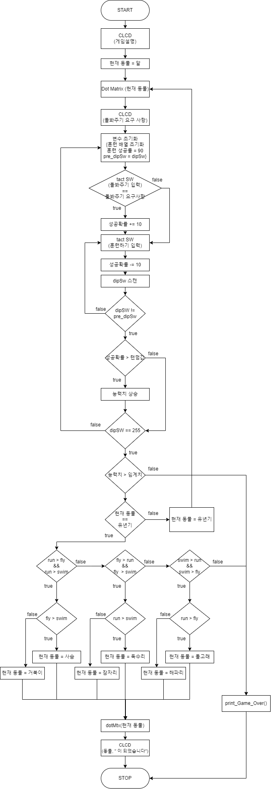

# **Digivice**

## 개요
H-Smart4412TKU를 이용하여 사이버 반려동물을 키우는 게임   
돌봐주기와 훈련을 통해 반려동물의 능력치를 상승시켜 알에서 유년기, 성체로 진화 시키고 다양한 성체 모습을 보는것이 목표

## 게임 방법
- 게임 시작시 알에서 유년기로, 유년기에서 성체로 진화 시키기 위해 각 8일이 주어진다.
- 하루마다 돌봐주기를 통해 그날의 훈련 성공률을 높이고, 여러가지 훈련을 통해 반려동물의 능력치를 상승시킬 수 있다.
- 훈련 전 돌봐주기는 동물이 그날 원하는 돌봄을 선택하여 그날의 훈련 성공률을 높일 수 있다.
- 훈련은 4가지로 구성되어 있으며 각 훈련마다 상승하는 능력치가 다르다.
	1. 달리기
	2. 수영하기
	3. 비행하기
	4. 사냥
- 하루치 훈련은 원하는 만큼 선택하여 진행할 수 있지만(중복 가능) 선택한 훈련이 많아질수록 그날의 훈련 성공률이 감소한다. 
- 훈련 선택을 완료하면 dip switch를 하나씩 올려 선택한 훈련을 일괄 진행하고 훈련의 성공 여부 및 결과를 알려준다.
- 8일 후 반려동물의 능력치에 따라 진화 여부가 결정된다. 능력치가 진화 임계치를 넘지 못하면 진화에 실패하며 게임 오버
- 유년기에서 성체로 진화하는 경우라면 동물의 높은 능력치에 따라 6가지 다른 성체 모습을 확인할 수 있다.

## Flow Chart

## 개발 과정
- [1주차](/docs/2023_05_18.md) (23/05/18)
- [2주차](/docs/2023_05_24.md) (23/05/24)
- [3주차](/docs/2023_06_01.md) (23/06/01)
- [최종](/docs/IoT%20%ED%94%84%EB%A1%9C%EC%A0%9D%ED%8A%B8%20%EC%B5%9C%EC%A2%85%20%EB%B3%B4%EA%B3%A0%EC%84%9C.md) (23/06/15)

## 시연 영상
https://www.youtube.com/watch?v=L_unhSBAJqI

