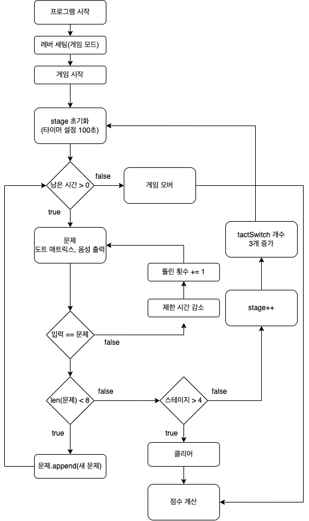
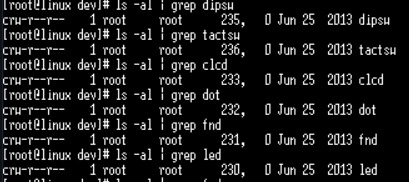
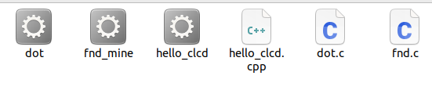
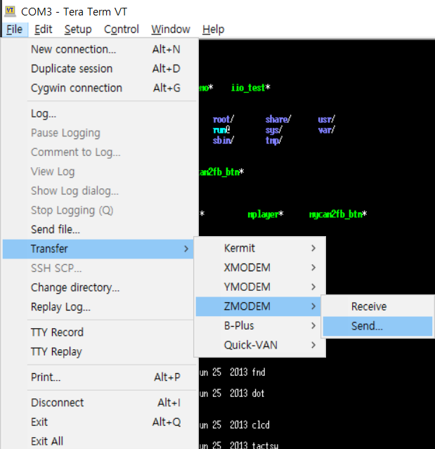
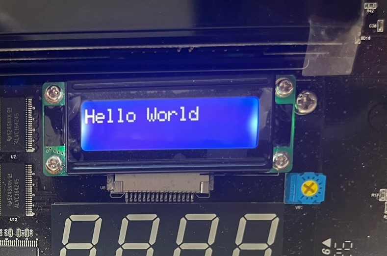

<h1 style="text-align: center"> 숫자 기억하기</h1>

<br/>
<div style="text-align: right"> 1조 </div>
<div style="text-align: right"> 2018250042 이종석 </div>
<div style="text-align: right"> 오준열 </div>
<div style="text-align: right"> 2018250033 유규빈 </div>

<br/>
<br/>
<br/>
<br/>
<br/><br/><br/>

# 1. 게임 설명

- 게임을 시작하기 전 dip switch를 사용해서 모드를 설정.
- 게임을 시작하면 Dot matrix와 음성을 이용해서 숫자를 출력해주는데 그에 맞는 숫자의  TactSwitch를 눌러 맞춤.
- 각 스테이지에서 총 8번의 숫자누적이 있고, 제한시간을 초과하면 게임오버.
- 플레이 도중에 숫자를 맞추지 못했을 시 틀린횟수를 하단 FND에 표시, 제한시간 감소.
- 각 스테이지의 8번 누적된 숫자 문제를 모두 맞췄을 시 ,다음 스테이지로 이동 해서 위의 내용을 반복.
	- 스테이지 예시) 
	- 1-1, 1-2, 1-3, ..., 1-8
	- 2-1, 2-2, 2-3, ..., 2-8
- 각 스테이지 별로 사용되는 tact switch의 개수가 다름. 
	- 1스테이지: 3개, 2스테이지: 6개, 3스테이지: 9개, 4스테이지: 12개
- 4스테이지까지 클리어시, 게임이 끝나고 최종점수를 CLCD에 출력.

</br>

# 2. FlowChart



</br>

# 3. 입출력 장치

우선 입출력 장치를 사용하기 위해 드라이브를 확인하였다. 
타겟 시스템의 `/dev` 디렉토리에서 입출력 장치 드라이브를 확인할 수 있다.


> dipsw, tactsw, clcd, dot, fnd, led를 확인할 수 있다.

</br>

**입출력 장치들의 동작을 확인하기 위해 인터넷의 예시코드를 컴파일하여 실행시켰다.**
1. c 소스코드 작성
2. 크로스 컴파일러로 컴파일, 실행파일 생성
3. 타겟시스템으로 실행파일 전송
4. 타겟시스템에서 실행

### 3-1 소스코드 작성

hello_clcd.cpp
```cpp
#include <iostream>
#include <fcntl.h>
#include <unistd.h>

#define clcd "/dev/clcd"

int main() {
    int clcd_1;
    clcd_1 = open(clcd, O_RDWR); 

    if (clcd_1 < 0) {
        std::cout << "디바이스 드라이버가 없습니다.\n";
        return 0;
    }

    write(clcd_1, "Hello World", 12);

    close(clcd_1);
    return 0;
}
```

dot.c
```c
#include <stdio.h>
#include <stdlib.h>
#include <fcntl.h>

#define dot "/dev/dot"

int main()
{
	int dot_d,i;
	unsigned char alpha[26][8]=
	{
		{0x3C, 0x66, 0x66, 0x66, 0x7E, 0x66, 0x66, 0x00}, //A
		{0x7C, 0x66, 0x66, 0x7C, 0x66, 0x66, 0x7C, 0x00}, //B
		{0x3C, 0x66, 0x60, 0x60, 0x60, 0x66, 0x3C, 0x00}, //C
		{0x78, 0x6C, 0x66, 0x66, 0x66, 0x6C, 0x78, 0x00}, //D
		{0x7E, 0x60, 0x60, 0x7C, 0x60, 0x60, 0x7E, 0x00}, //E
		{0x7E, 0x60, 0x60, 0x7C, 0x60, 0x60, 0x60, 0x00}, //F
		{0x3C, 0x66, 0x60, 0x7E, 0x66, 0x66, 0x3E, 0x00}, //G
		{0x66, 0x66, 0x66, 0x7E, 0x66, 0x66, 0x66, 0x00}, //H
		{0x3C, 0x18, 0x18, 0x18, 0x18, 0x18, 0x3C, 0x00}, //I
		{0x1E, 0x0C, 0x0C, 0x0C, 0x6C, 0x6C, 0x38, 0x00}, //J
		{0x66, 0x6C, 0x78, 0x70, 0x78, 0x6C, 0x66, 0x00}, //K
		{0x60, 0x60, 0x60, 0x60, 0x60, 0x60, 0x7E, 0x00}, //L
		{0x66, 0xFF, 0xFF, 0xDB, 0xDB, 0xC3, 0xC3, 0x00}, //M
		{0x66, 0x66, 0x76, 0x7E, 0x6E, 0x66, 0x66, 0x00}, //N
		{0x3C, 0x66, 0x66, 0x66, 0x66, 0x66, 0x3C, 0x00}, //O
		{0x7C, 0x66, 0x66, 0x7C, 0x60, 0x60, 0x60, 0x00}, //P
		{0x3C, 0x66, 0x66, 0x66, 0x66, 0x7E, 0x3C, 0x06}, //Q
		{0x7C, 0x66, 0x66, 0x7C, 0x78, 0x6C, 0x66, 0x00}, //R
		{0x3C, 0x66, 0x60, 0x3C, 0x06, 0x66, 0x3C, 0x00}, //S
		{0x7E, 0x18, 0x18, 0x18, 0x18, 0x18, 0x18, 0x00}, //T
		{0x66, 0x66, 0x66, 0x66, 0x66, 0x66, 0x3C, 0x00}, //U
		{0x66, 0x66, 0x66, 0x66, 0x66, 0x3C, 0x18, 0x00}, //V
		{0xC3, 0xC3, 0xC3, 0xDB, 0xDB, 0xFF, 0x66, 0x00}, //W
		{0x66, 0x66, 0x3C, 0x18, 0x3C, 0x66, 0x66, 0x00}, //X
		{0x66, 0x66, 0x66, 0x3C, 0x18, 0x18, 0x18, 0x00}, //Y
		{0x7E, 0x06, 0x0C, 0x18, 0x30, 0x60, 0x7E, 0x00}  //Z
	};
	dot_d = open(dot, O_RDWR);
	if(dot_d<0)
	{
		printf("error\n");
		return 0;
	}
	for(i=0; i<26; i++)
	{
		write(dot_d, &alpha[i], sizeof(alpha[i]));
		sleep(1);
	}
	close(dot);
	return 0;
}
```

fnd.c
```c
#include<stdio.h>
#include<stdlib.h>
#include<fcntl.h>
#include<string.h>

#define fnd "/dev/fnd"

int main()
{
	int fnd_d;
	unsigned char fnd_data[4];

	fnd_d = open(fnd , O_RDWR); //해당 드라이버 열기
	//0값을 넣어본다.
	fnd_data[0]=~0x06;
	fnd_data[1]=~0x4B;
	fnd_data[2]=~0x4F;
	fnd_data[3]=~0x66;
	write(fnd_d , fnd_data , sizeof(fnd_data));
	sleep(1);

	fnd_data[0]=~0x6D;
	fnd_data[1]=~0x7D;
	fnd_data[2]=~0x07;
	fnd_data[3]=~0x7F;
	write(fnd_d , &fnd_data , sizeof(fnd_data)); //배열이름에 &를 붙이면 메모리가 충돌나는 것을 방지 시킨다.

	sleep(1);
	close(fnd_d);
	return 0;

}
```


</br>

### 3-2 컴파일, 실행파일 생성
개발 cd에 제공된 크로스 컴파일러를 사용하여 실행파일을 생성한다.



</br>

### 3-3 타겟 시스템으로 실행파일 전송
Tera Term으로 타겟시스템에 실행파일을 전송했다.



</br>

### 3-4 실행
```
chmod 777 ${실행파일}
./${실행파일}
```

clcd.cpp




dot.c


fnd.c


코드 출처 : https://cccding.tistory.com/m/category/Embedded/Kernel%20Porting
