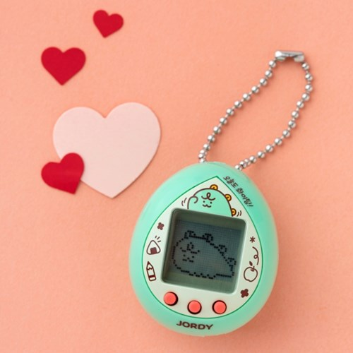
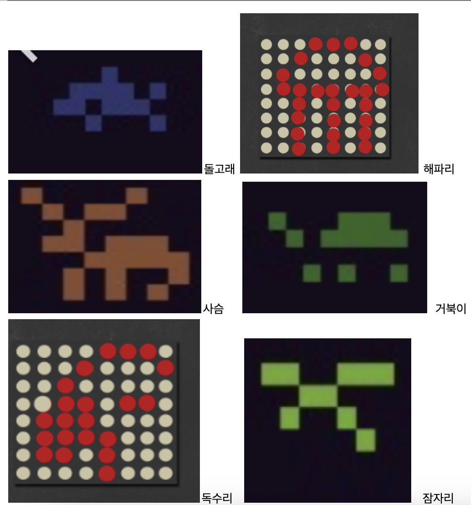
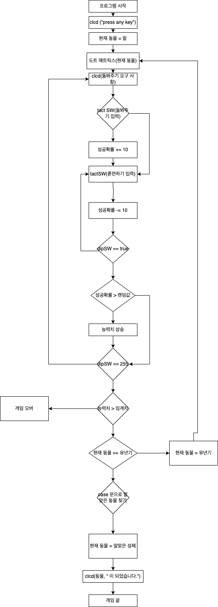
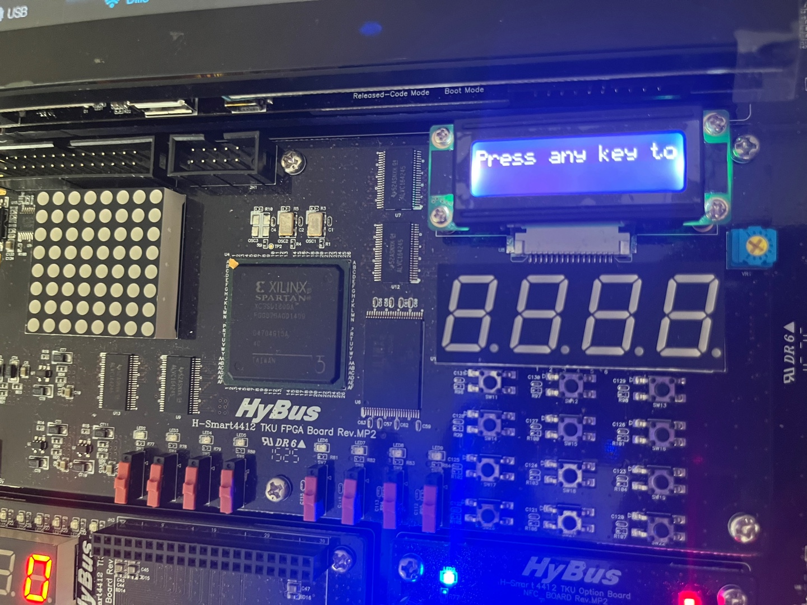
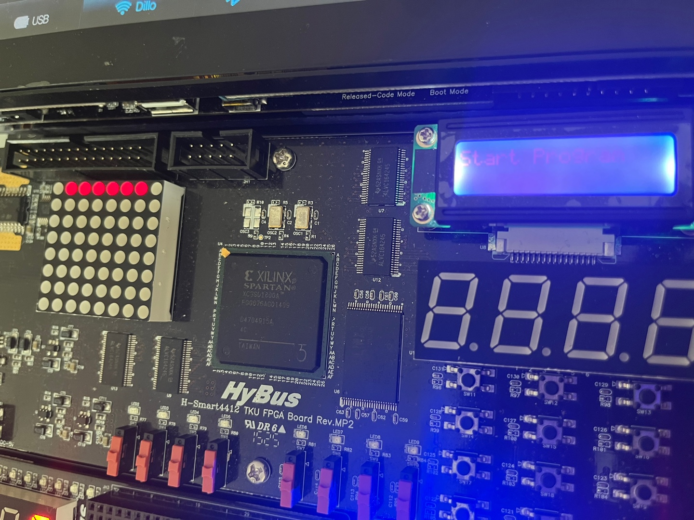

# 기존 게임 파기 사유
디바이스의 드라이버중 스피커관련 드라이버를 찾지 못함

# 새로운 게임 

## 다마고치


1996년 일본의 반다이와 주식회사 위즈에서 만든 장난감으로 기계 안에서 가상의 애완동물을 키우는 육성 시뮬레이션 게임

다마고치 게임 만들기 제안
-   알 - 유년기 - 성체 순서
-   알에서 유년기로 가는 것은 한가지 루트, 유년기에서 성체로 성장하는 것은 여러가지
	-   이브이처럼 현재 능력치에 따라 다르게 진화
-   진화를 하기 위해서는 사용자의 조작이 필요함
-   tact switch로 훈련의 종류와 개수를 입력 후, dip switch로 훈련 시작
-   dip switch가 8개 이므로 각 성장기 당 8번의 훈련 가능
-   훈련의 종류는 tact switch로 결정,
	-   한 번의 훈련에 여러가지 tact switch를 누를 수 있음
	-   단, 한 번의 훈련에 tact switch를 여러번 눌러 많이 할 경우 그 훈련의 성공 확률 감소
	-   fnd에 훈련 성공 확률 표시
-   8번의 dip switch를 모두 조작한 뒤 임계값을 넘지 못하면 진화 실패
-   사이버 반려동물의 다양한 성체 모습을 보는 것이 목표
-   IDLE, 훈련 성공, 훈련 실패의 dot matrix 애니메이션을 준비

훈련 종류
-   수영
-   달리기
-   비행하기
-   사냥

돌봐주기
-   밥주기
-   씻기기
-   놀아주기
-   재우기

진화 조건
-   가장 높은 능력치 1, 2 등의 순열로 성체를 결정
-   1, 2등의 능력치가 같다면 실패

CLCD
-   반려동물 상태표시
-   성체 됐을때 어떤 동물인지 표시
-   애완동물의 상태 해결시 해결완료 상태를 표시
  
dip switch를 작동할 때마다 상태초기화. 상태 - 해결의 반복
(dip switch 작동 후 내려야함 -> CLCD에 안내)

8번의 dip switch 작동을 통해 진화하지 못했을 시 게임 오버, 프로그램 종료

## 성체



## flow chart




## 입출력 장치 테스트 코드 

dot matrix, clcd, tact switch에 대한 입출력 장치 확인
```cpp
#include <iostream>
#include <string>

#include<unistd.h> 			// POSIX 운영체제 API에 대한 액세스 제공
#include<fcntl.h> 			// 타겟시스템 입출력 장치 관련
#include<sys/types.h> 		// 시스템에서 사용하는 자료형 정보
// #include<sys/ioctl.h> 		// 하드웨어의 제어와 상태 정보
#include<sys/stat.h> 		// 파일의 상태에 대한 정보
#include <time.h> 			// 시간 관련

#define fnd "/dev/fnd" 		// 7-Segment FND 
#define dot "/dev/dot" 		// Dot Matrix
#define tact "/dev/tactsw" 	// Tact Switch
#define led "/dev/led" 		// LED 
#define dip "/dev/dipsw"	// Dip Switch
#define clcd "/dev/clcd" 	// Character LCD

using namespace std;

int printClcd(string str);
int getTactSw(unsigned char& input);
int drawDotMTX(unsigned char& input, unsigned int sleepSec);
int drawDotMTX2(unsigned char input[], unsigned int sleepSec);
int drawDotMTX3(unsigned char input, unsigned int sleepSec);

int clcds;
int dipSw;
int fnds;
int tactSw;
int dotMtx;
int a = 0b0101010;
unsigned char figure[] = {0x7E, 0x60, 0x60, 0x7C, 0x60, 0x60, 0x7E, 0xff}; //E
unsigned char figure2[] = {0x7E, 0x60, 0x60, 0x7C, 0x60, 0x60, 0xff, 0xff};
unsigned char figure3[] = {0x7E, 0x60, 0x60, 0x7C, 0x60, 0xff, 0xff, 0xff};

int main() {
    printClcd("Press any key to start Game");
    while (true){
        unsigned char tactSwInput = 0;
        getTactSw(tactSwInput);
        if (tactSwInput == 0) continue;
        else{
            cout << "Current tact switch input : " << tactSwInput << endl;
            break;
        }
    }

    printClcd("Start Program");
    
    int startTime, currentTime;
    startTime = clock();
    currentTime = clock();
    cout << "dot1 run" << endl;
    while( currentTime - startTime < 3000000 ){ //5000ms
        drawDotMTX(*figure, 450000);
        currentTime = clock();
    }
    
    cout << "dot2 run" << endl;
    startTime = clock();
    currentTime = clock();
    while( currentTime - startTime < 3000000 ){ //5000ms
        drawDotMTX2(figure2, 450000);
        currentTime = clock();
    }

    cout << "dot3 run" << endl;
    startTime = clock();
    currentTime = clock();
    while( currentTime - startTime < 3000000 ){ //5000ms
        drawDotMTX3(*figure3, 450000);
        currentTime = clock();
    }

    printClcd("Press any key to terminate Program");
    while (true){
        unsigned char tactSwInput = 0;
        getTactSw(tactSwInput);
        if (tactSwInput == 0) continue;
        else{
            cout << "Current tact switch input : " << tactSwInput << endl;
            break;
        }
    }

    return 0;
}

int printClcd(string str){
    clcds = open(clcd, O_RDWR);

    if (clcds < 0){
        cout << "can't find Dev dirver" << endl;
        return -1; 
    }

    if (write(clcds, str.c_str(), str.size()) == -1){
        cout << "file write error" << endl; // str.size()이 걸로 되는지 모르겠음
        return -1;
    } 
    close(clcds);
    return 0;
}

int getTactSw(unsigned char& input){
    tactSw = open(tact, O_RDWR);
    if (tactSw < 0) {
        cout << "can't find Dev driver" << endl;
        return -1;
    }
    read(tactSw, &input, sizeof(input));
    close(tactSw);
    return 0;
}

int drawDotMTX(unsigned char& input, unsigned int sleepSec){
    dotMtx = open(dot, O_RDWR);
    if (dotMtx < 0) {
        cout << "can't find Dev dirver" << endl;
        return -1; 
    }
    write(dotMtx, &input, sizeof(input));
    usleep(sleepSec);
    close(dotMtx);
    return 0;
}

int drawDotMTX2(unsigned char input[], unsigned int sleepSec){
    dotMtx = open(dot, O_RDWR);
    if (dotMtx < 0) {
        cout << "can't find Dev dirver" << endl;
        return -1; 
    }
    write(dotMtx, &input, sizeof(input));
    usleep(sleepSec);
    close(dotMtx);
    return 0;
}

int drawDotMTX3(unsigned char input, unsigned int sleepSec){
    dotMtx = open(dot, O_RDWR);
    if (dotMtx < 0) {
        cout << "can't find Dev dirver" << endl;
        return -1; 
    }

    write(dotMtx, &input, sizeof(input));
    usleep(sleepSec);
    close(dotMtx);
    return 0;
}
```
결과 : 실패



<br/>
<br/>





# 참고

동물 픽셀 아트

https://www.reddit.com/r/PixelArt/comments/twukqv/animals_8x8_cc/

코드 참고

[https://scarlettb.tistory.com/5](https://scarlettb.tistory.com/5)
[https://danco.tistory.com/69](https://danco.tistory.com/69)
[https://bubble-dev.tistory.com/entry/CC-write](https://bubble-dev.tistory.com/entry/CC-write)
[https://bubble-dev.tistory.com/entry/CC-read-%ED%95%A8%EC%88%98-%ED%8C%8C%EC%9D%BC%EC%9D%84-%EC%9D%BD%EB%8A%94-%ED%95%A8%EC%88%98](https://bubble-dev.tistory.com/entry/CC-read-%ED%95%A8%EC%88%98-%ED%8C%8C%EC%9D%BC%EC%9D%84-%EC%9D%BD%EB%8A%94-%ED%95%A8%EC%88%98)
