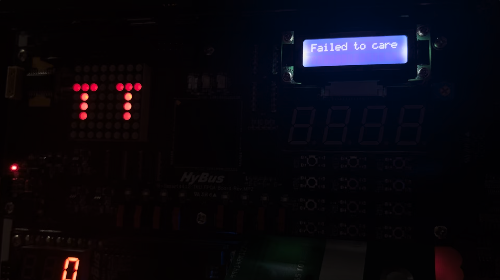
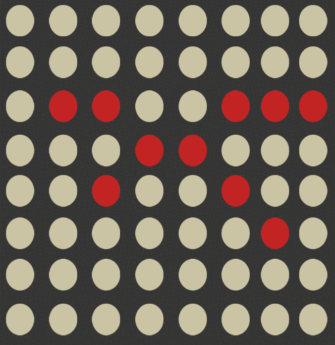

# 프로그램 설명

게임 시작 전 간단 메뉴얼 clcd로 출력

 

 

<br/>

dip switch 초기화 확인

<p>
	
</p>

<br/>

돌봐주기 
- 질문

<p>
	
</p>

- 성공

<p>
	
</p>


- 실패

<p>
	
</p>
- 예외처리
 
<p>
	
</p>

<br/>

훈련하기
- 성공확률, tact switch 상호작용

<p>
	
</p>

- dip switch 작동시 성공(clcd, dot matrix)

<p>
	
	<br/>
	 <br/>
	 <br/>
	 
</p>


- dip switch 작동시 실패(clcd, dot matrix)

<p>
	
</p>

- 예외처리

<p>
	
</p>

<br/>

dip switch 8개 모두 작동 시 진화
- 진화 애니메이션
  - 알 -> 유년기
<p>
	
</p>

<br/>

  - 유년기 -> 성체
<p>
	
</p>

<br/>

진화 실패모습 (게임 오버)

<p>
	
</p>


</br>

# 펫 애니메이션
<br/>

### 알
<p>
	        
</p>

<br/>
<br/>
<br/>

### 유년기

<p>
	         
</p>

<br/>
<br/>
<br/>

### 사슴

<p>
	         
</p>

<br/>
<br/>
<br/>

### 거북이

<p>
	         
</p>

<br/>
<br/>
<br/>

### 독수리

<p>
	         
</p>

<br/>
<br/>
<br/>

### 잠자리

<p>
	         
</p>

<br/>
<br/>
<br/>

### 해파리

<p>
	         
</p>

<br/>
<br/>
<br/>

### 돌고래

<p>
	         
</p>

<br/>
<br/>
<br/>


# 개발 과정
## 2주차
### 개발 내용
- 기존 게임 파기 후 새로운 프로젝트 구상 및 기획
- 코드 작성에 필요한 동작 명세를 FLOW CHART로 표현
- 프로젝트에 사용될 입출력장치들의 확인을 위한 코드 작성 및 테스트
## 3주차
### 개발 내용
- 돌봐주기, 훈련입력, 훈련 후 능력치 상승, 진화 결정등을 구현할 함수 작성
- Dot Matrix, CLCD, TactSw, DipSw, FND 입출력 장치 작동 함수를 작성
### 목표
- 가독성을 위한 코드 리팩토링 필요
- 각자 작성한 코드들을 병합하여 하나의 main함수로 작성
## 4주차
### 개발 내용
- 게임 시작 전 간단 게임 메뉴얼 출력
- 각종 동작 함수들을 합쳐 하나의 프로그램으로 작정
- 프로그램 실행 중 **항상** dot matrix에 애완동물 출력
- 애완동물의 간단한 애니메이션 추가

### 문제 발생, 목표
- 하나의 프로그램으로 작성하는 도중 dip switch 입력과 tact swtich 입력을 확인하기 위한 중첩 반복문에서 두 루프를 한번에 탈출하지 못하는 문제 발생
- 애니메이션의 움직임 주기를 `clock()` 함수를 사용하였는데 실행 중 `clock()`함수가 올바른 값을 리턴하지 못함

</br>

## 5주차
### 개발 내용
- 중첩 반복문 중 내부의 반복문을 함수로 작성하여 tact switch의 입력을 확인하고, dip switch 작동에 의해 2중 반복문을 탈출할 조건이 충족되면 `false` 를 리턴하여 중첩 반복문을 탈출
- 애니메이션 주기를 `clock()` 대신 `gettimeofday()` 함수를 이용하여 애니메이션 주기 통제
- 진화 애니메이션 추가
- fnd 출력 함수 재 작성
- tact switch, dip swtich 예외 입력 처리

</br></br>

# 핵심 코드

애니메이션 구현
```c++
struct timeval cur, start;

int main() {
	gettimeofday(&start, NULL);
	while (tatcSwInput == 0){
		IdleAnimation(figure[next], shiftedPic, draw, toggle);
		getTactSw(tatcSwInput);
	}
	return 0;
}

void IdleAnimation(
    vector<unsigned char> pic, vector<unsigned char> shiftedPic,
    vector<unsigned char>& draw, bool& toggle){
  
    gettimeofday(&cur, NULL);
    if (toggle){
        if (cur.tv_sec - start.tv_sec >= 3 && cur.tv_usec > start.tv_usec){
            toggle = !toggle;
            gettimeofday(&start, NULL);
            draw = shiftedPic;
        }
    }
    else {
        if (cur.tv_sec - start.tv_sec >= 1 && cur.tv_usec > start.tv_usec){
            toggle = !toggle;
            gettimeofday(&start, NULL);
            draw = pic;
        }
    }
    drawDotMTX(draw, 250000);
}
```
>단순히 `sleep()`으로 애니메이션의 지속시간을 설정하지 않았기 때문에  
>tact switch, dip switch의 입력을 받으면서 dot matrix에서 애니메이션을 연출 할 수 있다.  
>기존 `drawDotMTX()` 함수를 사용하는 곳이면 어디든 대체하여 사용이 가능하다.

</br>

중첩 반복문 탈출
```c++
int main() {
	while (train(successRate, trainings, trainClcd, pre_dipSwInput, dipSwInput)) {
		// dipSw가 변경될 때 까지 반복(대기)
	}
	return 0;
}

bool train(int& successRate, vector<int>& trainings,
	string& trainClcd, unsigned char pre_dipSwInput, unsigned char& dipSwInput){
	
	int training = 0;
	printClcd(trainClcd);
	printFnd(successRate, 1000000);
	gettimeofday(&start, NULL);
	while (training == 0){
		getTactSw(training);
		usleep(1000);
	
		getDipSw(dipSwInput);
		if (pre_dipSwInput != dipSwInput){
			return false;
		}
	}
	
	if ( training > 4 ){
		//잘못된 입력
		printClcd("  Wrong Input! ");
		usleep(500000);
	}
	else{
		trainings.push_back(training);
		trainClcd += to_string(training) + " ";
		successRate -= 10;
		if (training == 4){
			successRate += 3; // 사냥은 7 감소
		}
	}
	return true;
}
```
>tact switch 입력시 내부 반복문이 종료, dip switch 입력시 전체 반복문이 종료된다.  
>중첩 반복문을 종료하기 위해서는 내부의 반복문이 우선적으로 종료되어야 외부의 반복문도 종료가 가능한데,  
>이를 함수로 만들고 외부 반복문의 종료조건 시 false 를 리턴하며 중첩 반복문이 종료된다.

</br></br>

# 프로그램 실행 영상

</br></br>

# 완성도 및 독창성
## 완성도
- 게임 시작 전 간단한 설명 제시
- `srand((unsigned int)time(NULL))`를 이용하여 다양한 랜덤값 생성
- `1`, `2`, `3`, `4`를 제외한 다른 tact swtich 입력에 대한 예외 처리
- 잘못된 dip switch 동작 예외 처리
- 생동감을 위한 애완동물의 IDLE 애니메이션 제작
- 애완 동물의 진화 연출 제작
- 돌봐주기, 훈련의 성공과 실패 시의 연출
- fnd 출력 중 필요없는 부분 제거

## 독창성
- 프로젝트의 아이디어(주제) 중복 없음
- 기존에 없던 게임, 새로운 규칙 작성
- 기본적인 입출력 장치의 사용방법을 제외하고 타 프로젝트의 코드를 참고하지 않음
- 우리 프로젝트만의 애니메이션 알고리즘 작성
- 알, 유년기 모습의 dot 이미지 직접 생성

</br></br>

# 참고 문헌
c++ 기본 문법 참고
- [https://scarlettb.tistory.com/5](https://scarlettb.tistory.com/5) 
- [https://danco.tistory.com/69](https://danco.tistory.com/69) 
- [https://bubble-dev.tistory.com/entry/CC-write](https://bubble-dev.tistory.com/entry/CC-write)
- [https://bubble-dev.tistory.com/entry/CC-read-%ED%95%A8%EC%88%98-%ED%8C%8C%EC%9D%BC%EC%9D%84-%EC%9D%BD%EB%8A%94-%ED%95%A8%EC%88%98](https://bubble-dev.tistory.com/entry/CC-read-%ED%95%A8%EC%88%98-%ED%8C%8C%EC%9D%BC%EC%9D%84-%EC%9D%BD%EB%8A%94-%ED%95%A8%EC%88%98)

fnd 참고
- [https://m.blog.naver.com/PostView.naver?isHttpsRedirect=true&blogId=almdri02&logNo=150123104874](https://m.blog.naver.com/PostView.naver?isHttpsRedirect=true&blogId=almdri02&logNo=150123104874)
- [https://github.com/jinwoo1225/SnakeGameWithSmart4412/blob/main/Snake/FND.cpp](https://github.com/jinwoo1225/SnakeGameWithSmart4412/blob/main/Snake/FND.cpp)

입출력 장치 참고
- [https://cccding.tistory.com/category/Embedded/Kernel%20Porting](https://cccding.tistory.com/category/Embedded/Kernel%20Porting)
- [https://github.com/jinwoo1225/SnakeGameWithSmart4412](https://github.com/jinwoo1225/SnakeGameWithSmart4412)

난수 생성
- [https://blockdmask.tistory.com/308](https://blockdmask.tistory.com/308)
- [https://coding-factory.tistory.com/666](https://coding-factory.tistory.com/666)

`gettimeofday()`함수 참고
- https://mozi.tistory.com/127
- https://blog.naver.com/PostView.naver?blogId=japchae153&logNo=222295431893&parentCategoryNo=&categoryNo=35&viewDate=&isShowPopularPosts=true&from=search
- https://bywords.tistory.com/entry/CLinux-gettimeofday%EB%A1%9C-%EB%A7%88%EC%9D%B4%ED%81%AC%EB%A1%9C%EC%B4%88-%EB%8B%A8%EC%9C%84-%EC%B8%A1%EC%A0%95%ED%95%98%EA%B8%B0
